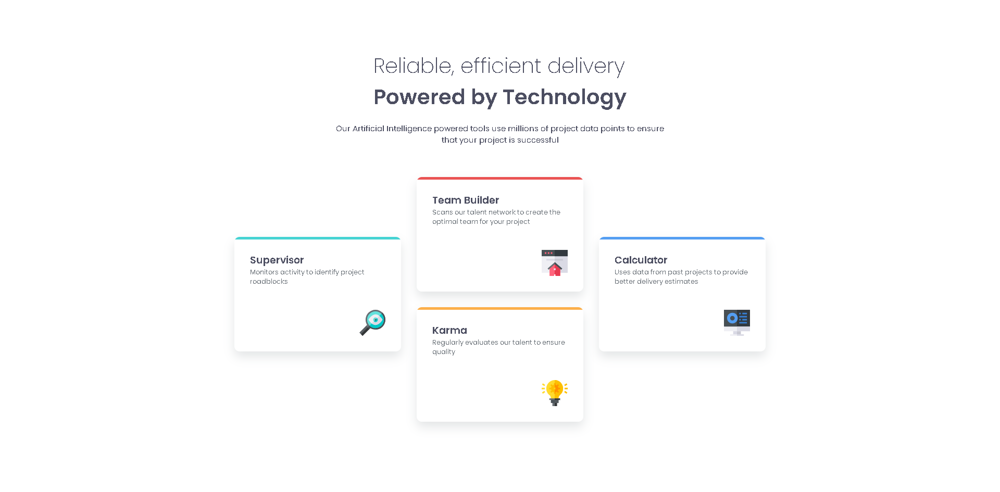

# 🧩 Four Card Feature Section

<div align="center">


### 📊 Seção de features com layout moderno e organização em múltiplos cards


</div>

---

## 🚀 Demonstração

🔗 **Live Preview:** https://anaclarissi.github.io/four-card-feature-section/

💻 **Repositório:** https://github.com/anaClarissi/four-card-feature-section

---

## 📷 Preview

<div align="center">



</div>

---

## 🧠 Sobre o projeto

Este projeto é uma **seção de funcionalidades com múltiplos cards**, desenvolvido como parte de um desafio do **Frontend Mentor**.

O objetivo foi recriar um layout moderno com cards organizados em diferentes colunas, focando em:

* 🎯 Fidelidade ao design original
* 🎨 Organização visual e espaçamento
* 📱 Responsividade
* 🧩 Estrutura de layout com múltiplos elementos

---

## 🎯 Desafio

Este projeto foi baseado no desafio oficial:

* 🧩 **Four Card Feature Section**
* 🔗 https://www.frontendmentor.io/challenges/four-card-feature-section-weK1eFYK

---

## 👩‍💻 Meu perfil no Frontend Mentor

Confira meu perfil e outros desafios:

* 🔗 https://www.frontendmentor.io/profile/anaClarissi

---

## ⚙️ Funcionalidades

* 📊 Exibição de cards informativos
* 🎨 Destaque visual com cores diferentes
* 🧩 Organização em layout de colunas
* ✨ Sombras e estilo moderno
* 📱 Layout responsivo para diferentes telas

---

## 🛠 Tecnologias utilizadas

<div align="center">

| Tecnologia   | Descrição            |
| ------------ | -------------------- |
| HTML5        | Estrutura semântica  |
| CSS3         | Estilização e layout |
| Google Fonts | Tipografia (Poppins) |

</div>

---

## 📂 Estrutura do projeto

```bash
four-card-feature-section/
│
├── index.html
├── assets/
│   ├── css/
│   │   └── style.css
│   ├── images/
│   │   ├── icon-supervisor.svg
│   │   ├── icon-team-builder.svg
│   │   ├── icon-karma.svg
│   │   └── icon-calculator.svg
│   └── favicon-32x32.png
```

---

## 🧩 Como funciona

* Layout construído com **Flexbox**
* Organização dos cards em:

  * coluna esquerda
  * coluna central (dupla)
  * coluna direita
* Estilização com:

  * variáveis CSS (`:root`)
  * cores personalizadas para cada card
* Responsividade com **media queries**

```css
@media (max-width: 1060px) {
  .card-container {
    flex-direction: column;
  }
}
```

---

## 🎨 Destaques do projeto

* 🎯 Layout moderno com múltiplos cards
* 🎨 Uso estratégico de cores
* 🧠 Organização visual bem estruturada
* ✨ Uso de sombras e espaçamento
* 📱 Adaptação para diferentes telas

---

## 📦 Como rodar o projeto

```bash
# Clone o repositório
git clone https://github.com/anaClarissi/four-card-feature-section.git

# Acesse a pasta
cd four-card-feature-section

# Abra o index.html no navegador
```

---

## 📌 Aprendizados

Durante este projeto, foram praticados:

* Organização de layouts com múltiplos elementos
* Uso de Flexbox
* Responsividade com media queries
* Hierarquia visual
* Uso de variáveis CSS
* Estruturação de componentes (cards)

---

## ✨ Melhorias futuras

* [ ] Melhorar responsividade em telas menores
* [ ] Adicionar animações sutis
* [ ] Tornar os cards interativos
* [ ] Versão com dados dinâmicos

---

## ⭐ Contribuição

Contribuições são bem-vindas!

1. Fork o projeto
2. Crie uma branch
3. Faça suas alterações
4. Envie um Pull Request

---

## 📄 Licença

Este projeto está sob a licença MIT.

---

<div align="center">

✨ Mais um desafio concluído! 🚀 ✨

</div>
